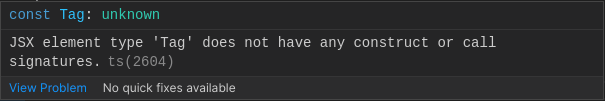
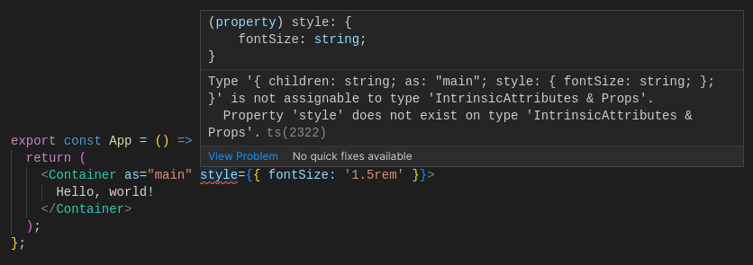

Polymorphic components are a React pattern for code reuse, which involves designing a component to accept a prop that modifies the type of the underlying node.

You may be familiar with polymorphic components if you've worked with certain React component libraries. For example, [Material UI](https://mui.com/) supports passing a `component` prop to some of its components to change their base HTML tag:

<!-- prettier-ignore -->
```jsx
import React from 'react';
import Box from '@mui/material/Box';

const BoxAsSection = () => (
  <Box component="section">This is a section</Box>
);
// -> <section>This is a section</section>

const BoxAsMain = () => (
  <Box component="main">This is the main content</Box>
);
// -> <main>This is the main content</main>
```

[Reach UI](https://reach.tech/) has a similar api, only it uses `as` as the prop:

<!-- prettier-ignore -->
```jsx
import React from 'react';
import {
  Accordion,
  AccordionItem,
  AccordionButton,
  AccordionPanel,
} from '@reach/accordion';

const AccordionExample = () => (
  <Accordion>
    <AccordionItem as="section">
      <h3>
        <AccordionButton>
          Button to expand the accordion
        </AccordionButton>
      </h3>
      <AccordionPanel>
        Accordion content
      </AccordionPanel>
    </AccordionItem>
  </Accordion>
);
```

While you may not need to use polymorphic components in your own code every day, they can be very helpful in certain cases to avoid having to build multiple components with the same logic or styling, where the only real difference is the underlying HTML tag they use.

Polymorphic components are simple enough to create with JavaScript, but (as is often the case) TypeScript throws some unexpected curveballs. In this post I'll show you a method for creating polymorphic components with TypeScript, by walking you through creating a polymorphic `<Container />` component.

<CodeNote href="https://github.com/jonrutter/blog-examples/tree/main/typescript-polymorphic-components" />

## Polymorphic Components in JavaScript

Creating our polymorphic component in JavaScript is fairly straightforward:

```jsx filename=src/components/container.js
import React from 'react';

// component:
export const Container = ({ as, children, ...rest }) => {
  const Tag = as || 'div';
  return <Tag {...rest}>{children}</Tag>;
};

// using the component:
const MainContainer = () => {
  return <Container as="main">Hello, world!</Container>;
};
// -> <main>Hello, world!</main>
```

<Note color="blue">

_**Note**: in a real app, `<Container />` would have some kind of reusable logic or styling that would be worthwhile to share between different element types. But for simplicity and readabilty I am leaving that out here._

</Note>

Let's break this component down:

1. First we define an `as` prop, through which we can tell `<Container />` how to render.
2. Next, we check whether `as` was passed to `<Container />`, and if not, we fall back to a `div` tag.
3. Finally, we use [rest parameters](https://developer.mozilla.org/en-US/docs/Web/JavaScript/Reference/Functions/rest_parameters) to gather the remaining props as `...rest`, and pass them directly to the component, along with `children`.

<Note color="yellow">

_**Note**: it's important to re-assign `as` to a capitalized variable like `Tag`, because React expressions that yield an element type must be [assigned to a capitalized variable](https://reactjs.org/docs/jsx-in-depth.html#choosing-the-type-at-runtime) in order to be valid JSX._

</Note>

## Enter TypeScript

JavaScript is great, but developers are increasingly turning to TypeScript to add static type checking to their applications, as this can reduce bugs and greatly improve the development experience.

Without TypeScript, we could accidentally render some wonky and invalid HTML with our polymorphic components.

Let's say we wanted to create a polymorphic `<Button />` component, which is designed to be able to render as either a `<button>` or an `<a>` tag. Even though we _intend_ that the component only render as a button or anchor, nothing in our approach above would enforce that.

Consider the following bugs, none of which would be caught by JavaScript:

<!-- prettier-ignore -->
```jsx
import React from 'react';
import { Button } from './button';

// typo in the tag name:
const TypoButton = () => (
  <Button as="buton">
    Button
  </Button>
);
// -> <buton>Button</buton>

// element with an invalid attribute:
const InvalidButton = () => (
  <Button as="button" href="/">
    Button
  </Button>
);
// -> <button href="/">Button</button>

// element with an unknown element type:
const InvalidTag = () => (
  <Button as="potato">
    Button
  </Button>
);
// -> <potato>Button</potato>
```

All of these components would result in invalid HTML, but JavaScript will happily render them, assuming that this was what we meant to do. Needless to say, that isn't ideal!

One big benefit of TypeScript is that, if we build our component correctly, it will catch all of these problems immediately and give us a helpful error message right in our editor. As an added bonus, TypeScript can work with our editor to intelligently autocomplete and suggest props based on what we pass with `as`.

## Add Type Checking to our Component

The first thing I like to do when writing a new React component is to think about what props it might need, and type them. Let's take an initial stab at that. It's not immediately clear how to type `as`, so let's set it as `unknown` for the moment:

```tsx filename=src/components/container.tsx
type Props = {
  as?: unknown; // we'll come back to this
  children: React.ReactNode;
};
```

Then we need to type our props in the component:

```tsx filename=src/components/container.tsx
export const Container = ({ as, children, ...rest }: Props) => {
  const Tag = as || 'div';
  return <Tag {...rest}>{children}</Tag>;
};
```

Predictably, this code produces a TypeScript error, complaining that 'Tag does not have any construct or call signatures':



To fix the error we need to correctly type `as`. If you take a look at the React type definitions, you'll see that there's a built-in React type called `ElementType` that represents a [JSX element or React Component](https://github.com/DefinitelyTyped/DefinitelyTyped/blob/master/types/react/index.d.ts#L70). This seems like the right fit, so let's use that:

```tsx filename=src/components/container.tsx
import React from 'react';

type Props = {
  as?: React.ElementType;
  children: React.ReactNode;
};

export const Container = ({ as, children, ...rest }: Props) => {
  const Tag = as || 'div';
  return <Tag {...rest}>{children}</Tag>;
};
```

The error is gone! By typing `as` as a `React.ElementType`, we get two benefits:

1. We can pass both native HTML elements and custom components to our polymorphic container, and it will understand both.
2. We will now get an error if `as` is not a valid HTML element or a component.

Great! But now let's see what happens when we try to pass props to our new component:

<!-- prettier-ignore -->
```tsx filename=src/App.tsx
export const App = () => (
  <Container as="main" style={{ fontSize: '1.5rem' }}>
    Hello, world!
  </Container>
);
```



Uh oh. Now we have another error. TypeScript is now complaining that "Property 'style' does not exist on type 'IntrinsicAttributes & Props".

So what happened? We haven't typed the `style` prop, so TypeScript doesn't know how to deal with it. We could just add `style` to our user-defined `Props` inside `<Container />`, but what if we wanted to also pass `className`, or some `aria` attributes. Wouldn't it be better if we could just tell TypeScript: "this component should accept all props defined in `Props`, and also all props associated with whatever HTML tag was passed with `as`"?

It turns out that there's a React type that does exactly this: ComponentProps. There are two varieties of ComponentProps that we can use: `ComponentPropsWithoutRef` and `ComponentPropsWithRef`. Later on we'll deal with passing a `ref` to our polymorphic component, but for now let's focus on `ComponentPropsWithoutRef`.

`ComponentPropsWithoutRef` is a [generic type](https://www.typescriptlang.org/docs/handbook/2/generics.html) that expects us to pass it an element type. It will then return all HTML attributes that are supported by that element. So, for example, `ComponentPropsWithoutRef<'button'>` will include all HTML attributes that can be used by the `button` tag (e.g., `onClick`, `type`, `disabled`, etc.) and will _exclude_ all HTML attributes that are not valid for buttons (like `href`). Seems like exactly what we need! So let's add it to our Props via a type union:

```tsx filename=src/components/container.tsx
type Props = {
  as?: React.ElementType;
  children: React.ReactNode;
} & React.ComponentPropsWithoutRef<'div'>;
```

That silences that error, and TypeScript now recognizes that our component can receive a `style` prop. But we've hardcoded the default component type, `div`, and isn't the whole point of polymorphic components to allow dynamically passing the component type? What if we wanted to make our `<Container />` a button? Then the `div` props would no longer be correct. How do we let `ComponentPropsWithoutRef` know what the user-defined type is?

The answer is to make our `Props` type generic:

```tsx filename=src/components/container.tsx
type Props<T extends React.ElementType> = {
  as?: T;
  children: React.ReactNode;
} & React.ComponentPropsWithoutRef<T>;
```

So our `Props` type is now generic and expects a type parameter representing a React element, and sets that value to `as` and `ComponentPropsWithoutRef`. In order to use this in our component, all we need to do now is define our component as a [generic function](https://www.typescriptlang.org/docs/handbook/2/generics.html) that also expects a type parameter of an `ElementType`, and pass that type along to `Props`. Because of type argument inference, TypeScript will automatically figure out that the value passed to `as` is type `T`:

```tsx filename=src/components/container.tsx
export const Container = <T extends React.ElementType = 'div'>({
  as,
  children,
  ...rest
}: Props<T>) => {
  const Tag = as || 'div';
  return <Tag {...rest}>{children}</Tag>;
};
```

<Note color="blue">

_**Note**: we also needed to provide a default type value of `React.ElementType = 'div'`, in order to correctly type the component in cases where `as` was not passed._

</Note>

Now, TypeScript will correctly evaluate our props based on what we specify with `as`, so if we try something like:

<!-- prettier-ignore -->
```tsx filename=src/App.tsx
export const App = () => (
  <Container as="main" href="/">
    Hello, world!
  </Container>
);
```

TypeScript will correctly give us an error message, telling us that "Property 'href' does not exist" on our `Props` type.

There's just one more thing we need to do before our component is fully functional. There are possible edge cases where our user-specified props might clash with the default HTML props. For a (somewhat contrived) example, we might want to modify our `<Container />` component to accept an optional `title` prop, as an HTML element to put before the main content:

```tsx filename=src/components/container.tsx
type Props<T extends React.ElementType> = {
  as?: T;
  title?: React.ReactNode;
  children: React.ReactNode;
} & React.ComponentPropsWithoutRef<T>;
```

The problem is that ['title' is also a valid HTML attribute](https://developer.mozilla.org/en-US/docs/Web/HTML/Global_attributes/title), which is meant to contain information about the element, and usually appears as a tooltip. If we try passing a title as an HTML element to our component now, it will produce an error. There are a number of other little-used or depreciated [HTML attributes](https://developer.mozilla.org/en-US/docs/Web/HTML/Attributes) (e.g. 'color', 'bgcolor', 'border', 'height', 'width'), that shadow the kind of names we might want give to our own props, and thus could also unexpectedly cause problems in our component.

So really what we want is to remove from `ComponentPropsWithoutRef` anything that is also in `Props`. Fortunately, TypeScript has an [Omit utility](https://www.typescriptlang.org/docs/handbook/utility-types.html#omittype-keys) that will do just that. Let's refactor our props to make this clearer, and update `Props` to use `Omit`:

```tsx filename=src/components/container.tsx
type ContainerProps<T extends React.ElementType> = {
  as?: T;
  title?: React.ReactNode;
  children: React.ReactNode;
};

type Props<T extends React.ElementType> = ContainerProps<T> &
  Omit<React.ComponentPropsWithoutRef<T>, keyof ContainerProps<T>>;
```

That's a bit complex, so let's take a closer look:

1. We've moved the container-specific props to its own type, `ContainerProps`.
2. We define our base `Props` to be the union of our new `ContainerProps`, and all elements of `ComponentPropsWithoutRef` that are not also present in `ContainerProps`.

Doing that, we've dynamically filtered `title` out of `ComponentPropsWithoutRef`.

That takes care of the basic functionality! Our polymorphic component should now be working correctly. Here's the full code:

```tsx filename=src/components/container.tsx
import React from 'react';

type ContainerProps<T extends React.ElementType> = {
  as?: T;
  title?: React.ReactNode;
  children: React.ReactNode;
};

type Props<T extends React.ElementType> = ContainerProps<T> &
  Omit<React.ComponentPropsWithoutRef<T>, keyof ContainerProps<T>>;

export const Container = <T extends React.ElementType = 'div'>({
  as,
  title,
  children,
  ...rest
}: Props<T>) => {
  const Tag = as || 'div';
  return <Tag {...rest}>{children}</Tag>;
};
```

## Make It Reusable

Our polymorphic component is now working correctly, but it's not very reusable. Every time we want to create a new polymorphic component, we'll have to copy all this boilerplate. Since we'd like to avoid repeating ourselves, let's refactor our code to make the polymorphic logic reusable.

First let's create a new file, `src/utils/polymorphic.ts`, and give it a basic type export:

```typescript filename=src/utils/polymorphic.ts
import React from 'react';

export type PolymorphicProps<T extends React.ElementType, P = {}> = P;
```

Notice that `PolymorphicProps` will accept two type variables: `T`, which is the tag type, and `P`, which represents the component-specific props that we'll eventually need to filter out of `ComponentPropsWithoutRef`.

What can we generalize about all polymorphic components? All polymorphic components will use the `as` prop, so that's a good place to start. Let's extract that to its own type and add it to `PolymorphicProps`:

```typescript filename=src/utils/polymorphic.ts
import React from 'react';

type As<T extends React.ElementType> = {
  as?: T;
};

export type PolymorphicProps<T extends React.ElementType, P = {}> = P & As<T>;
```

We also need to grab the props that were inherited from `ComponentPropsWithoutRef`, excluding the component props. Like `As`, let's extract that to its own type for simplicity, and then add it to `PolymorphicProps`.

```typescript filename=src/utils/polymorphic.ts
import React from 'react';

type As<T extends React.ElementType> = {
  as?: T;
};

type InheritedProps<T extends React.ElementType, P = {}> = Omit<
  React.ComponentPropsWithoutRef<T>,
  keyof P
>;

export type PolymorphicProps<T extends React.ElementType, P = {}> = P &
  As<T> &
  InheritedProps<T, P & As<T>>;
```

Now that our `PolymorphicProps` has been extracted to its own type, we can import it and simplify our `<Container />` component:

```tsx filename=src/components/container.tsx
import React from 'react';
import type { PolymorphicProps } from '../utils/polymorphic';

type Props = {
  title?: React.ReactNode;
  children: React.ReactNode;
};

export const Container = <T extends React.ElementType = 'div'>({
  as,
  title,
  children,
  ...rest
}: PolymorphicProps<T, Props>) => {
  const Tag = as || 'div';
  return <Tag {...rest}>{children}</Tag>;
};
```

## Support `ref` Forwarding

Our polymorphic component is now fully working, and the logic is abstracted into a helper file so that we can easily create new components if needed, without needing to duplicate our code each time. Awesome!

However, if you ever need to [forward refs](https://reactjs.org/docs/forwarding-refs.html) to your polymorphic components, you'll find that the current setup doesn't work. So if you want your polymorphic component to support ref forwarding, we'll need to make some changes.

First, we'll need to add a few new types to our `polymorphic.ts` module. Since we originally wrote our `PolymorphicProps` to use `ComponentPropsWithoutRef`, we'll need to write some new types to add `ref`:

```typescript filename=src/utils/polymorphic.ts
export type PolymorphicRef<T extends React.ElementType> =
  React.ComponentPropsWithRef<T>['ref'];

export type PolymorphicPropsWithRef<
  T extends React.ElementType,
  P = {}
> = PolymorphicProps<T, P> & { ref?: PolymorphicRef<T> };
```

So we have two new type definitions:

1. `PolymorphicRef` uses `ComponentPropsWithRef` to get the element props with `ref` included, and uses `["ref"]` to extract just the `ref` type
2. `PolymorphicPropsWithRef` adds the `ref` back to our `PolymorphicPropsWithRef`

<Note color="blue">

_**Note**: we could have updated our original `PolymorphicProps` to support refs, but I decided to extend it with new definitions, so we can still write polymorphic components that don't forward refs, if we want to._

</Note>

We can now rewrite our `<Container />` component to use `React.forwardRef`:

```tsx filename=src/components/container.tsx
import React from 'react';
import type {
  PolymorphicPropsWithRef,
  PolymorphicRef,
} from '../utils/polymorphic';

type Props = {
  title?: React.ReactNode;
  children: React.ReactNode;
};

export const Container = React.forwardRef(
  <T extends React.ElementType = 'div'>(
    { as, title, children, ...rest }: PolymorphicPropsWithRef<T, Props>,
    ref?: PolymorphicRef<T>
  ) => {
    const Tag = as || 'div';

    return (
      <Tag {...rest} ref={ref}>
        {children}
      </Tag>
    );
  }
);
```

This code should work, but unfortunately there's a problem: by wrapping our component in `forwardRef`, TypeScript no longer knows how to type the `<Container />` component, so all of our type support is suddenly broken! You can verify this by trying out:

<!-- prettier-ignore -->
```tsx filename=src/App.tsx
export const App = () => (
  <div>
    <Container as="main" href="/">
      Oops!
    </Container>
  </div>
);
```

Well that's not what we wanted.

The solution I found to this problem is to explicitly type the component itself. Here's an example of one way to do that:

<!-- prettier-ignore -->
```tsx filename=src/components/container.tsx
type ContainerType = <T extends React.ElementType = 'div'>(
  props: PolymorphicPropsWithRef<T, Props>
) => React.ReactElement | null;

export const Container: ContainerType = React.forwardRef
  (
    // ...
  );
```

Basically what we're doing here is mirroring [React's own component type defintitions](https://github.com/DefinitelyTyped/DefinitelyTyped/blob/master/types/react/index.d.ts#L519), except we're explicitly typing `props` as the `PolymorphicPropsWithRef`.

But it would be a pain to have to write out an explicit type definition of every polymorphic component we create. And that repetition could introduce typos and bugs. So let's create a general purpose `PolymorphicComponent` type, to type our polymorphic components that support ref forwarding:

```typescript filename=src/utils/polymorphic.ts
export type PolymorphicComponent<
  P = {},
  D extends React.ElementType = 'div'
> = <T extends React.ElementType = D>(
  props: PolymorphicPropsWithRef<T, P>
) => React.ReactElement | null;

// component use:
export const Container: PolymorphicComponent<Props, 'div'> = // ...
```

This is largely just copied from `ContainerType`, except we've added an optional extra type parameter, `D`, representing the component's default element type. By passing in a default element type, we can easily extend our `PolymorphicComponent` with different types, and the functionality will not break if we omit `as`:

```tsx filename=src/components/button.tsx
import { PolymorphicComponent } from '../utils/polymorphic';

// `Props` omitted
export const Button: PolymorphicComponent<Props, 'button'> = // ...
```

In the spirit of React's own type definitions (`React.FunctionComponent` = `React.FC`), we can also create a shorthand of `PolymorphicComponent` and export it:

```typescript filename=src/utils/polymorphic.ts
export type PC<
  P = {},
  D extends React.ElementType = 'div'
> = PolymorphicComponent<P, D>;
```

Finally, here is our completed, strongly typed `<Container />` component, with full support for ref forwarding:

```tsx filename=src/container/container.tsx
import React from 'react';
import {
  PolymorphicPropsWithRef,
  PolymorphicRef,
  PC,
} from '../utils/polymorphic';

type Props = {
  title?: React.ReactNode;
  children: React.ReactNode;
};

export const Container: PC<Props, 'div'> = React.forwardRef(
  <T extends React.ElementType = 'div'>(
    { as, title, children, ...rest }: PolymorphicPropsWithRef<T, Props>,
    ref?: PolymorphicRef<T>
  ) => {
    const Tag = as || 'div';

    return (
      <Tag {...rest} ref={ref}>
        {children}
      </Tag>
    );
  }
);
```

## Summary

That's it! If you made it this far, congratulations! You now have fully functional, strongly typed polymorphic components, with support for ref forwarding.
